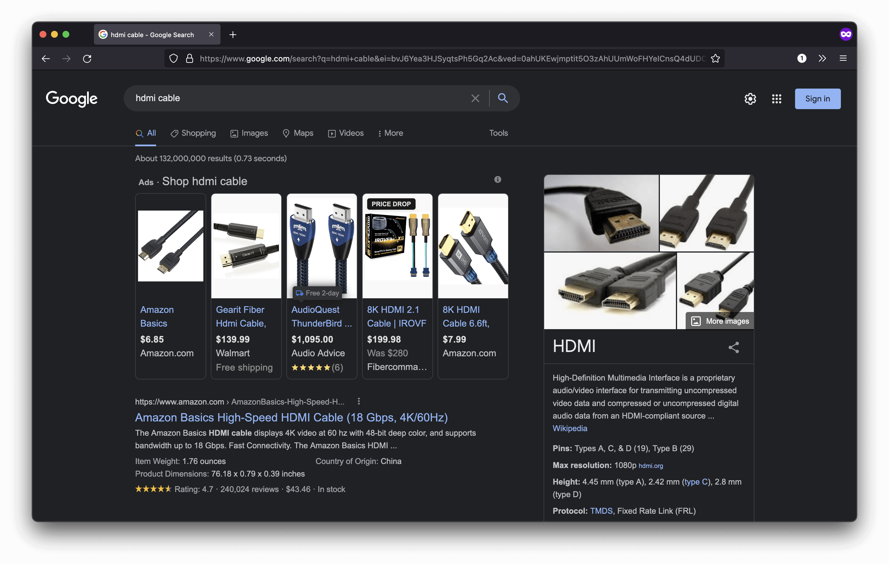
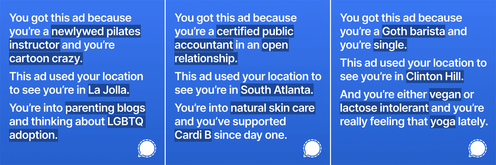

type: post
title: You are the Product
description: Finding out about the hidden price of internet services we take for granted.
createdAt: 2021-10-28
tags: Privacy

---
"If you aren't paying for it, You are the product." A phrase that's repeated over and over again in discussions regarding privacy and ethics issues surrounding internet giants. Google, Facebook, Instagram, among countless other companies, all offer their services for free. Never before has connectivity been so easy, and vast stores of information have been so accessible. Worrying, however, is how much we take for granted whilst surfing and interacting with the internet. Now, as controversies involving various ethical dilemmas enshroud what we consider the foundations of the internet, it may be a good time to reassess what parts of our lives we're willing to compromise for the luxury of the internet and see how You are being productized.

# How Google sells You
Google's search engine is commonly thought to be one of the most advanced pieces of software infrastructure developed to date, and for good reason. [According to Google](https://www.google.com/search/howsearchworks/how-search-works/organizing-information/), their Search Index contains more than 100 petabytes of data and over 130 trillion entries. But the cost of handling more than 5 billion searches run per day is immense, and Google isn't a free service. 

Seeing opportunity in targeted ad placements, Google has created one of the largest advertising networks, and one of the most successful. These advertisements are placed in relevant places, oftentimes targeting specific groups of individuals. For example, when I searched for "HDMI cables," the top result was links to marketplaces that paid to be there:  

And how do they do this? Well, Google tries to create a unique profile to track people as they interact with the internet. They do this in various ways, such as through Google Analytics, and various other fingerprinting technologies. [Here's](https://fingerprintjs.com/blog/audio-fingerprinting/) an interesting article about one of these fingerprinting methods. They also collect your search data, YouTube trends, and even things like location history and Mobile Phone usage. For example, when I downloaded the data that Google has on me, I saw that every single Google search I'd made since 2014 was archived, every YouTube video I've watched, and even every single Google Maps Location I've accessed. (which I found to be most unsettling) And once they have this profile, Google allows various entities to pay to reach specific demographics using the profiles that Google creates on them, oftentimes with chilling accuracy.

# Complicit Companies
Facebook, Instagram, and various other big tech companies hold lots of similarities to Google in the way they profit off of their users. Although the method in which they collect data may be slightly different, the principle is the same, if not more privacy-invasive. [A project done by Signal](https://signal.org/blog/the-instagram-ads-you-will-never-see/), shows how much data advertisers are given about you when paying for targeted ad placements. Here's a quick preview of what they found:  

Even more worrying, perhaps, are the various reports coming to light about how some companies are complicit in tactics both morbidly unethical and in some cases, downright illegal. Recently exposed is ["Project Jedi Blue"](https://www.forbes.com/sites/enriquedans/2021/01/19/jedi-blue-a-scandal-that-highlights-yet-again-the-need-to-regulate-bigtech/), a plan in which Google and Facebook have created what is effectively an illegal advertising monopoly.

# Things you can do
Detailing all that you can do is slightly out of the scope of this post, but the gist of it is:
* Support laws that introduce and enforce privacy rights, for example, the [EU's GPDR](https://en.wikipedia.org/wiki/General_Data_Protection_Regulation) law.
* Switch to using more privacy-aware applications, if possible. For example, Firefox over Chrome, Signal over Whatsapp, or even Duckduckgo over Google. 
* Use an ad and tracker blocker such as [uBlockOrigin](https://ublockorigin.com/)

In the end, it's a tradeoff between what you deem essential internet services, and what you consider an unacceptable invasion of privacy, but possibly the worst thing one can do is remain ignorant about issues with such widespread impacts.